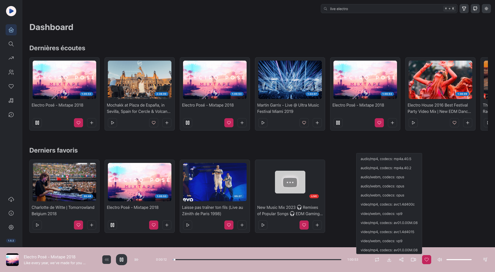
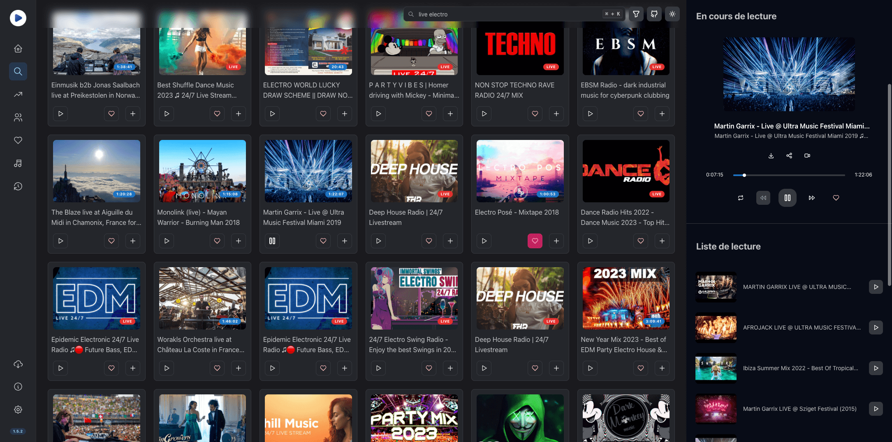
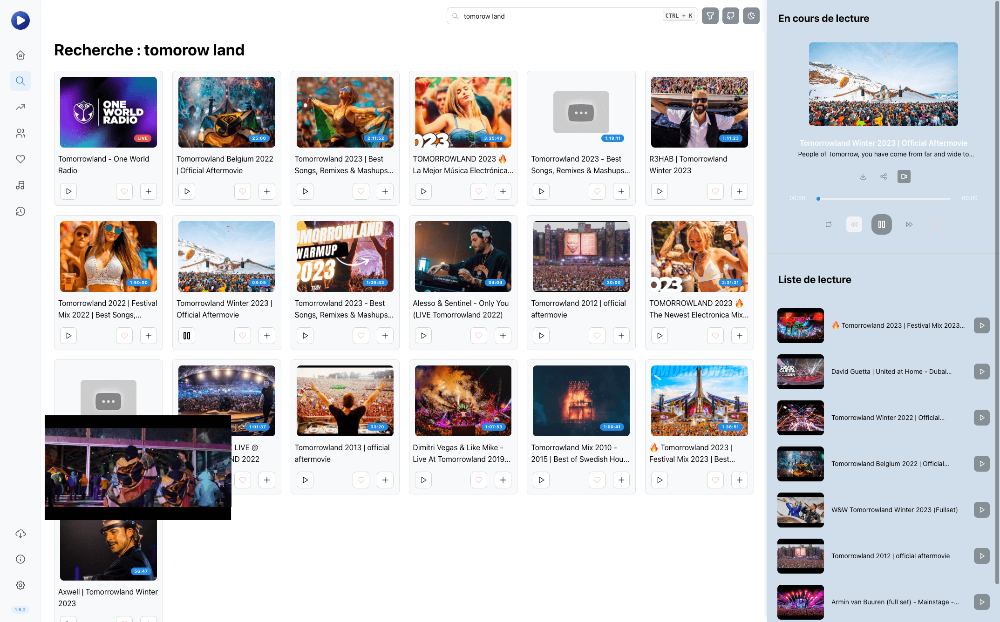
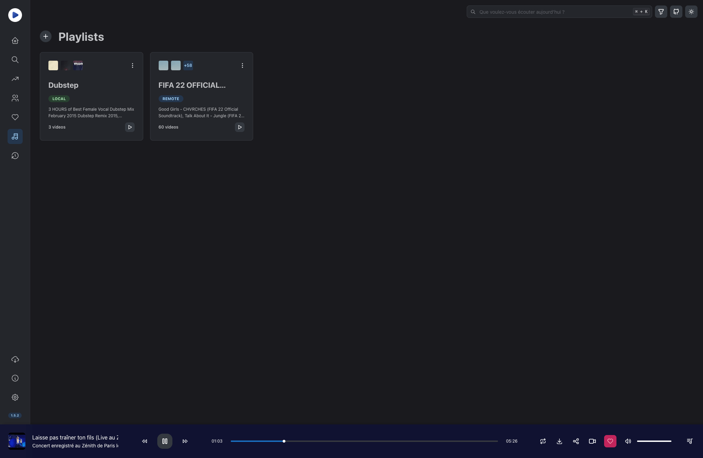
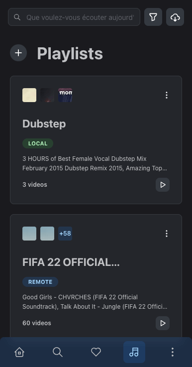

<p align="center"></p>
<h2 align="center" style="border: 0">HoloPlay</h2>
<p align="center">
    <a href="https://opensource.org/licenses/MIT"></a>
    <a href="https://github.com/stephane-r/holoplay-pwa-"></a>
    <a href="https://github.com/stephane-r/holoplay-pwa"></a>
    <a href="https://hub.docker.com/r/spout8301/holoplay/tags"></a>
    
    <a href="https://github.com/stephane-r/holoplay-pwa/issues"></a>
    <a href="https://github.com/stephane-r/holoplay-pwa/pulls"></a>
</p>

<p></p>
<p></p>

## 🔍 Table of Contents

- [📌 Overview](#📌-overview)

- [🚀 Getting Started](#🚀-getting-started)

  - [Setup](#setup)
  - [Docker](#docker)

- [💻 Stack](#💻-stack)

- [📊 Plausible Analytics](#📊-plausible-analytics)

- [🔥 About Invidious](#🔥-about-invidious)

- [🙌 Contributors](#🙌-contributors)

- [📄 License](#📄-license)

## 📌 Overview

HoloPlay is a Youtube alternative app using [Invidious API](https://github.com/omarroth/invidious). You can save music to favoris or create your playlists. This project is fully open source.

If you want add more feature, PM, MR or PR are welcome :)

[](./docs/screenshots/dashboard.png)
[](./docs/screenshots/search.png)
[](./docs/screenshots/search-light-mode.png)
[](./docs/screenshots/playlists.png)

<br>

[](./docs/screenshots/mobile.png)
[](./docs/screenshots/playlists-mobile.png)
[](./docs/screenshots/favorite-mobile.png)

## ✨ Features

- **Search on Invidious or Youtube Music**
- **Search videos, playlists and channels**
- **Create your playlists**
- **Save videos, playlists and channels in favorites**
- **Download source**
- **Data Syncing between devices** (by using [Holoplay Serverless](https://github.com/stephane-r/holoplay-serverless))
- **Internationalization : 🏴󠁧󠁢󠁥󠁮󠁧󠁿 English, 🇫🇷 French, 🇯🇵 Japanese, 🇷🇺 Russian and 🇩🇪 German**
- **Respect your privacy**
- **Sponsor Block**
- **Responsive**
- **Dark Theme**
- **Background mode with PWA installation**

## 🚀 Getting Started

These instructions will get you a copy of the project up and running on your local machine for development and testing purposes.

### Setup

First, use **Node.js 18** or higher.

Copy `.env.dist` to `.env` and change `REACT_APP_API_URL`:

```bash
REACT_APP_API_URL=http://localhost:3001 # Or https://holoplay-serverless.vercel.app
```

Then, install dependencies:

```bash
npm i
```

And start project in development mode:

```bash
npm start
```

### Docker

If you prefer Docker, HoloPlay can be run in a container from official Docker hub:

```bash
docker run -d -p 3000:3000 spout8301/holoplay:latest
```

Or locally:

```bash
docker build -t holoplay .
docker run -d -p 3000:3000 holoplay
```

## 💻 Stack

- [React](https://reactjs.org)
- [React-Router-Dom](https://reactrouter.com/web/guides/quick-start)
- [React-Query](https://react-query.tanstack.com/)
- [Mantine](https://mantine.dev)
- [TypeScript](https://www.typescriptlang.org/)
- [Bubblewrap](https://github.com/GoogleChromeLabs/bubblewrap)

And others libraries, see [package.json](./package.json). Thank you to all contributors of these libraries 🔥 !

## 📊 Plausible Analytics

HoloPlay use [Plausible Analytics](https://plausible.io/), an transparent and fully open source [privacy-friendly analytics](https://plausible.io/privacy-focused-web-analytics) software.

Analytics page is public : [HoloPlay Plausible page](https://plausible.holoplay.io/holoplay.io)

## 🔥 About Invidious

[Invidious](https://github.com/iv-org/invidious) is an alternative front-end to YouTube. HoloPlay use all [Invidious public instances](https://api.invidious.io/). All instances are retrieved each time HoloPlay is launched.

## 🙌 Contributors

<a href="https://github.com/stephane-r/holoplay-pwa/graphs/contributors">
  
</a>

## 📄 License

This project is licensed under the MIT.

This README was partly generated with [easyreadme](https://easyreadme.vercel.app/builder).
